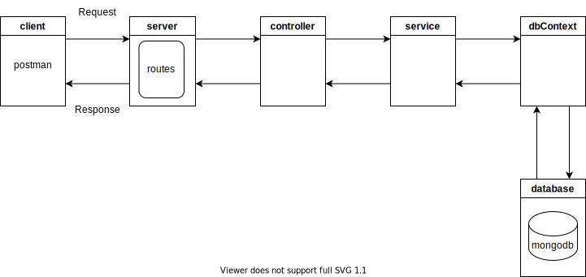

# express-js-mongodb-promise-api

A simple api using express.js and mongodb with async/await

## Requirements

* node.js ([https://nodejs.dev/learn/making-http-requests-with-nodejs](https://))
* express.js ([https://expressjs.com/](https://))
* mongodb ([https://www.mongodb.com/try/download/community](https://))
* mongodb native driver ([https://github.com/mongodb/node-mongodb-native](https://))
* Postman (optional for testing api)

## Diagram



## Components

* **config (config.js)**

  - configuration file

* **server (server.js)**

  - creates server and listens on a port 3000
  - defines routes and accepts requests (routes.js)
* **controller**

  - handles requests
* **service (service.js)**

  - handles business logic
* **model**

  - data
* **dbContext (dbContext.js)**

  - handles db connection
* **database (mongodb community server)**

  - mongodb database 

## Run

Run the following command from the root directory:

```
node .\server.js
```

## Tests

Try the following urls in Postman.

* GetTasks (GET)

  * http://127.0.0.1:3000/gettasks
* GetTask (GET)

  * http://127.0.0.1:3000/gettask/1
* AddTask (POST)

  * http://127.0.0.1:3000/addtask
  * body -> raw, json
  * { "id" : "1", "name": "task1", "description": "task1", "priority": "low", "status": "none" }
* UpdateTask (POST)

  * http://127.0.0.1:3000/updatetask
  * body -> raw, json
  * { "id" : "1", "name": "task11", "description": "task11", "priority": "medium", "status": "started" }
* DeleteTask (POST)

  * http://127.0.0.1:3000/deletetask
  * body -> raw, json
  * { "id" : "1" }
